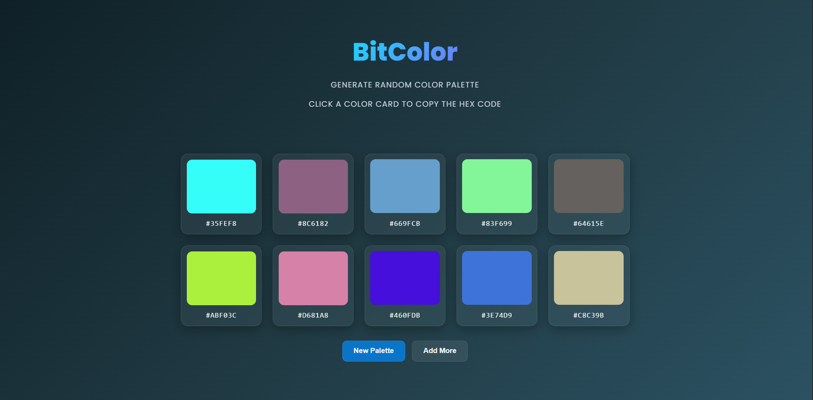

# 🎨 BitColor

**BitColor** is a modern Random Color Palette Generator that instantly creates beautiful hex color palettes.  
Generate, explore, and copy stunning colors with a clean and responsive UI.

---

## ✨ Features

- 🎲 Generate random HEX color palettes
- 🚀 Load more colors dynamically
- 🔄 Regenerate colors instantly
- 📋 Click-to-copy color codes
- 📱 Fully responsive layout

---

## 🖼️ Preview

## 🛠️ Built With

- HTML5
- CSS3 
- Vanilla JavaScript (DOM manipulation)

---

