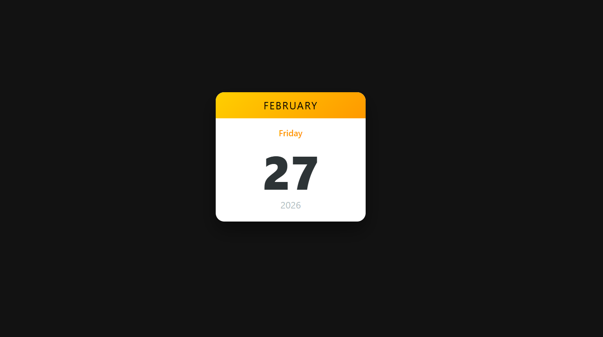

# Mini Calendar 📅

A simple and responsive Mini Calendar built using HTML, CSS, and JavaScript.  
It dynamically displays the current date, day, month, and year using the JavaScript Date object.

---

## 🚀 Features

- Displays current day, date, month, and year
- Automatically updates based on system time
- Clean and minimal UI
- Lightweight (No external libraries)
- Responsive layout

---

## 🛠 Tech Stack

- HTML5
- CSS3
- JavaScript (Vanilla JS)

---
## ⚙️ How It Works

- Uses JavaScript `Date()` object to get:
  - Current date
  - Current day
  - Current month
  - Current year
- Updates the DOM dynamically on page load
- Reflects real-time system date automatically

---

